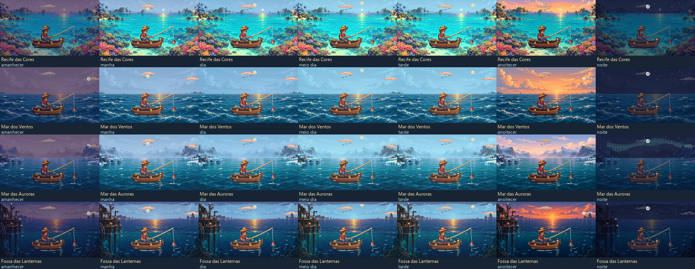
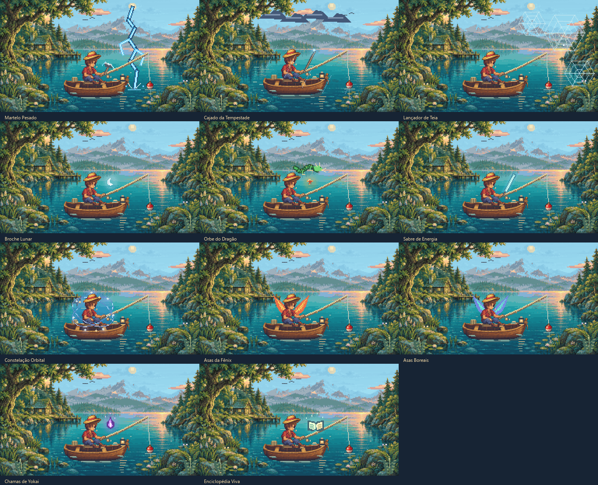

# Pesca Idle — Oito Águas

Jogo idle de pesca em Python/PySide6, com arte original em pixels e adaptação Android.

## Jogar com dois cliques

Baixe o [PescaIdle.exe atualizado](https://github.com/BernardoJ/PescaIdle/raw/refs/heads/codex/android-auditoria/PescaIdle.exe), salve no computador e abra com dois cliques. Não precisa instalar Python. O executável na raiz desta branch contém todos os recursos.

Build Windows: **50.163.246 bytes**. SHA256: `fa5ebad96d5ae616b429636543e9b9e338deaece2040e720a4949e86016bfc11`.
[Correções e validação atual](docs/AUDITORIA_ANDROID.md) · [Android](ANDROID.md).

## O que mudou

- Oito mapas, com sete cenários inéditos, desbloqueados permanentemente por nível de barco. Viagem gratuita pelo menu **Viajar**.
- 88 espécies aquáticas: 49 antigas preservadas e 39 novas; 68 peixes e 20 encontros especiais. Baleias e semelhantes são avistamentos, e plâncton é registrado por amostra.
- Sete períodos pelo relógio local: Amanhecer 05–07, Manhã 07–09, Dia 09–11, Meio-dia 11–14, Tarde 14–17, Anoitecer 17–20, Noite 20–05. Fim exclusivo.
- **Enciclopédia** com ordem alfabética/quantidade e filtros por local, período e disponível agora. Valor em 1 registro, raridade em 5, curiosidade em 10. Mostra descobertas por padrão; pistas opcionais de desconhecidas não revelam a identidade.
- Coleção global e regional separadas. Conquista original **Rei da pesca** conserva a meta de 49; **Explorador das oito águas** usa as 88 da expansão.
- **Fashionista**: somente cosméticos vendidos, excluindo o livro Enciclopédia Viva, opções grátis e peças de upgrade. A tela mostra progresso e nomes que faltam; recalcula ao abrir e comprar. **Enciclopédia Viva**: todas as informações reveladas, com acessório de livro flutuante grátis como recompensa.
- Capuz de raposa/elmo corrigidos, cabo de martelo menor, nuvens e chuva no cajado, mais teias, broche lunar luminoso, dragão verde orbitando a esfera laranja, brilho no sabre/constelação/chamas e asas mais vivas.
- Rótulos **Dragão Digital**, **Gorro de Rato Elétrico**, **Eu escolho você!** e **Mostre-me seu Coração Valente**, com IDs anteriores preservados.

A janela compacta abre no canto inferior direito, fica no topo e pode ser arrastada. A cena conserva 256×144 pixels lógicos, com ampliação inteira em pixels físicos e tipografia legível. Todos os cosméticos, os 11 níveis de barco/vara e a prévia da loja permanecem. Itens são ordenados por preço em cada categoria. Peças de upgrade são compradas na loja.




## Progresso e ausência

O save normal Windows continua em `%APPDATA%\PescaIdle\save.json`. A atualização migra para schema 3, com moedas em centésimos inteiros, backup anterior e escrita atômica. Preserva inventário, compras, equipamentos e conquistas. Normaliza o saldo antigo a duas casas, guardando o número original no backup. Capturas antigas continuam globais, sem atribuir local/horário desconhecido. Saves corrompidos ou futuros não são substituídos silenciosamente; um backup válido pode ser recuperado com confirmação. Duas instâncias não podem gravar no mesmo perfil. Android usa seu diretório privado.

Fisgadas congelam o resultado no início, inclusive ao viajar, pausar ou reabrir. O offline normal conta o **primeiro trecho de até quatro horas** da ausência, pescando em cada horário histórico; excesso é descartado uma vez. A pausa intencional persiste sem renda offline até retomar.

**Expedição offline** permite agendar um mapa liberado, nas próximas 24 h, por até 4 h. Substitui a renda normal daquela ausência. Paga somente a parte decorrida enquanto o jogo esteve fechado/suspenso; retornar consome a janela parcial. Não acorda o computador, não executa serviços e não paga tempo futuro. Se o jogo estiver aberto no início, o plano expira.

O replay usa UTC e offset salvo. Mudanças históricas de horário de verão durante a ausência não são reconstruídas. O jogo funciona offline, sem localização ou rede.

## Executar pelo código

```powershell
py -m venv .venv
.\.venv\Scripts\python.exe -m pip install -r requirements.txt
.\.venv\Scripts\python.exe pesca_idle.py
```

Ambiente efetivamente validado: Python 3.14.8, PySide6 6.11.2, Windows 11. Dependências estão fixadas nos arquivos de requirements. Para uma sessão manual de QA, configure o perfil **antes** de iniciar:

```powershell
$qa = Join-Path $env:TEMP ('pesca-manual-' + [guid]::NewGuid())
$env:PESCA_IDLE_SAVE_PATH = Join-Path $qa 'save.json'
.\.venv\Scripts\python.exe pesca_idle.py
```

## Build e validação

```powershell
.\.venv\Scripts\python.exe -m pip install -r requirements-build.txt
.\.venv\Scripts\python.exe -m PyInstaller --noconfirm PescaIdle.spec
```

Gera `dist/PescaIdle.exe`. O spec inclui PNG/JSON de produção recursivamente, preservando caminhos relativos; exclui masters de `assets/source`. Não inclui fontes, saves, ZIP, .git ou QA. Módulos e recursos são resolvidos pelo módulo/`sys._MEIPASS`, sem depender do cwd.

```powershell
$env:PESCA_IDLE_QA_DIR = Join-Path $env:TEMP ('pesca-qa-' + [guid]::NewGuid())
.\.venv\Scripts\python.exe tools\validate_game.py
.\.venv\Scripts\python.exe tools\smoke_exe.py dist\PescaIdle.exe
```

Os testes criam saves sintéticos e isolam APPDATA/LOCALAPPDATA antes de importar o jogo. O smoke usa plugin Windows, cwd estrangeiro e migra uma fixture v1. `validate_game` executa auditoria, matriz da expansão, regressão cosmética e balanceamento. `tools/test_windows_close.py <exe> --output <qa>` verifica saída nativa do processo e liberação do lock. `tools/validate_mobile.py` é uma prévia desktop, distinta do teste real do APK. Relatórios e imagens usam a pasta de QA, sem sobrescrever referências.

Resultados observados: **5.920** verificações da matriz e **1.359** de cosméticos; 56 cenas inspecionadas; 168 pools matemáticos e 7 inícios ×30 sementes de progressão. [Detalhes e limites](docs/VALIDACAO_EXPANSAO.md). O conjunto global antigo foi preservado como fixture de comparação, com seus 337 checks executados antes da expansão.

## Arquitetura e referências

- `pesca_catalogo.py` / `assets/catalogo_expansao.json`: única fonte de conteúdo no runtime, IDs e ocorrências regionais.
- `pesca_tempo.py`, `pesca_pescaria.py`, `pesca_offline.py`: relógio central, resultado pendente, RNG e replay histórico.
- `pesca_save.py`, `pesca_conquistas.py`: migração, persistência exclusiva/atômica, metas e recompensa.
- `pesca_idle.py`, `pesca_viagens_ui.py`, `pesca_ui.py`: janela, loja, coleção, viagem, expedição e diálogos.
- `pesca_visual.py`, `pesca_luz.py`, `pesca_regional_visual.py`, `pesca_efeitos.py`, `pesca_especies_visual.py`: composição, máscaras, iluminação, cosméticos e espécies.
- `assets/source/mapas`: masters inéditos do imagegen e prompts. `tools/prepare_maps.py --records <prompts.json>` prepara PNGs/máscaras finais; Pillow é só dependência de desenvolvimento.

[Expansão e arte](docs/EXPANSAO_MAPAS.md) · [Save e offline](docs/MIGRACAO_SAVE.md) · [Balanceamento](docs/BALANCEAMENTO_EXPANSAO.md) · [Fontes das 39 novas identidades](docs/FONTES_ESPECIES.md) · [Critérios antigos](CRITERIOS_RARIDADE.md).

A arte é própria, com personagem e barco existentes preservados e linguagem de RPG em pixels. Horários/ambientes são convenções do jogo; não representam coocorrência ou abundância científica exata. Curiosidades novas usam fatos taxonômicos verificados; as antigas foram preservadas e identificadas como legado.
