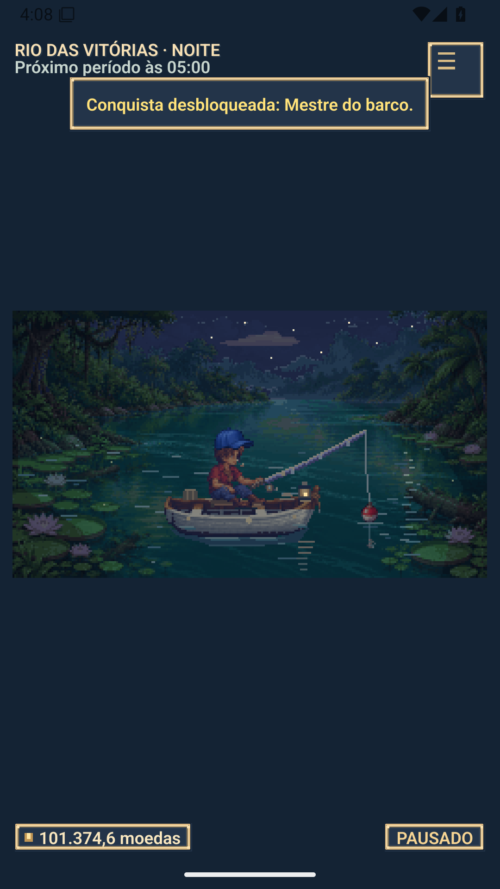
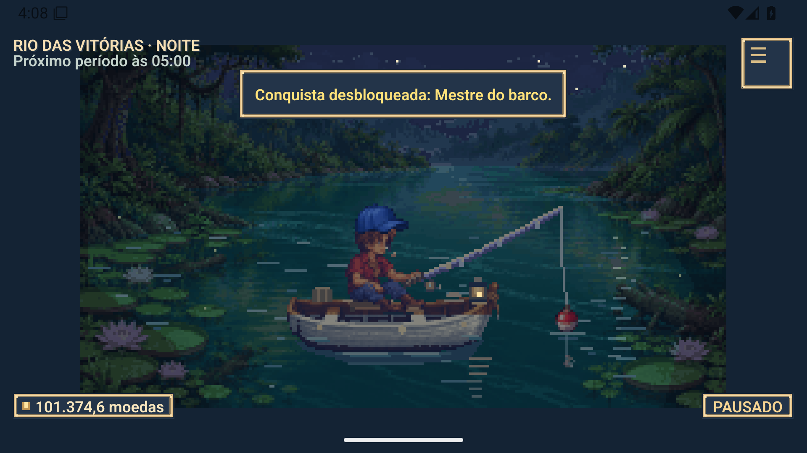
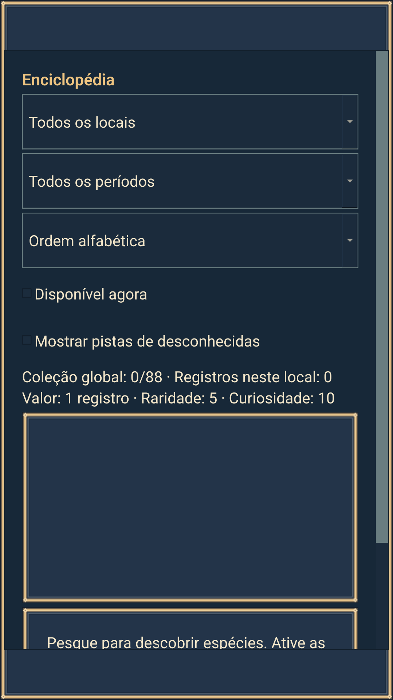

# Correções da auditoria e adaptação Android

Base preservada: expansão `b4c81121bddff8416fcfa4cbd5b2542f9d8b8f34`.
Relatório analisado integralmente: `Revisao_PescaIdle_6b29b4a0.md`, enviado pelo
usuário, uma revisão estática da main antiga. As evidências abaixo são desta tarefa.
Branch isolada: `codex/android-auditoria`; PR #3, sobre a branch da expansão #2.
Nenhum merge na main foi realizado. O checkout original e o save pessoal foram preservados.

## Achados e resultados observados

| Achado | Estado | Evidência desta versão |
|---|---|---|
| F1 | Corrigido | Snapshot serializado antes de escrever; temporário no mesmo diretório, flush/fsync e replace. Backup válido anterior e recuperação explícita que arquiva bytes rejeitados. Falhas de serialização, escrita parcial, fsync e replace preservam o último save. Falha de gravação pausa o jogo e é visível; não fecha como se tivesse salvo. |
| F2 | Corrigido | Lock do sistema operacional por caminho canônico antes do load. Testes multiprocesso: mesmo perfil/alias recusados, perfil separado permitido, liberação após fechar ou terminar a instância de teste. |
| F3 | Corrigido na expansão, revalidado | Motor consome todas as fases e sobras: espera 10 s + fisgada 1,5 s, avanço 120 s = 10 eventos + 5 s restantes. Offline histórico de até 4 h, sem pagamento duplicado. |
| F4 | Corrigido no fonte e executável | Ambos os timers param, save confirmado, lock liberado, processo termina. Testes reais do EXE por WM_CLOSE e SC_CLOSE, o caminho nativo usado por Alt+F4; smoke também percorre Sair. Falha de save impede fechar e informa o jogador. |
| F5 | Corrigido | Inteiros em centésimos em recompensas/compras/persistência; 150×0,2 permite comprar por 30 e termina em zero. Multiplicadores, migração v1/v2, quantização e round-trip cobertos. |
| F6 | Corrigido na expansão, revalidado | 50 aberturas/fechamentos de coleção e loja, timers parados e objetos destruídos após DeferredDelete, sem crescimento de diálogos filhos. Menus e painéis usam deleteLater. |
| F7 | Corrigido | Fila preserva várias conquistas mesmo com 100 avisos de captura. Última captura, último upgrade e última compra percorrem o fluxo real e conservam conquista e aviso de ação. |

Fashionista depende apenas dos cosméticos com preço positivo do catálogo da
loja; `enciclopedia_viva` é excluído explicitamente. Progresso/itens faltantes
aparecem em Conquistas. Ao abrir a versão nova, compras existentes recalculam
o desbloqueio; o teste não concede o livro para completar Fashionista.

## Testes locais executados

Python 3.14.8, PySide6 6.11.2, PyInstaller 6.22.3, Windows 11 build 26100.
Todos os comandos usam saves sintéticos, APPDATA/LOCALAPPDATA isolados e saída
temporária; nenhum artefato gráfico de referência foi substituído.

```text
python tools/validate_game.py
  11 testes de auditoria; 5.920 checks da expansão; 1.359 de cosméticos.
  Balanceamento: 168 pools e sete inícios ×30 sementes, todos aprovados.
python tools/validate_mobile.py
  13 checks: portrait/landscape, páginas roláveis, suspend/resume e pausa.
python -m PyInstaller --noconfirm --distpath <qa>/windows-safe-dist --workpath <qa>/windows-safe-build PescaIdle.spec
python tools/smoke_exe.py <qa>/windows-safe-dist/PescaIdle.exe
  Aprovado em QT_SCALE_FACTOR=1 e 1.25, plugin Windows, cwd estrangeiro.
python tools/test_windows_close.py <exe> --output <qa>/windows-safe-native
  WM_CLOSE e SC_CLOSE: saída 0, save v3 válido e lock liberado.
```

Medições de renderização desktop: mediana 1,44 ms; p95 1,58 ms.
Troca de mapa: mediana 312,9 ms; p95 329,8 ms. Medições offscreen do computador
de desenvolvimento, não promessa de desempenho em celulares.

## Distribuição Windows

Build produzido do snapshot `35a2483` (SHA completo no manifesto), que contém
as correções Windows e os ajustes condicionais da interface Android.
Binário novo: 50.164.461 bytes; SHA256
`be4143ddea790ef76fe2045d149d0456969bd44e4f468e5eb9d43fdc06ecd4a9`.
O binário anterior segue no histórico; a pasta Desktop em uso não foi substituída.

## Android

Mesma simulação, catálogo, recursos e efeitos, sem reimplementar o jogo antigo
da branch android-port. Menu de toque, páginas roláveis, orientação dinâmica,
perfil privado e reconciliação de ausência ao retornar do segundo plano.
Pacote ARM64 de produção e pacote x86_64 QA separado com save descartável.
O APK inclui o runtime. Não requer Python nem launcher adicional no telefone.

O [build ARM64 de produção](https://github.com/BernardoJ/PescaIdle/actions/runs/37722759610)
passou. Fonte: `35a2483f140b64075befe249a44be8bc9ab1e10d`.
APK assinado: 151.170.080 bytes; SHA256
`beeaeb7354b4215572e15151b1270384fee124645d68dc63c687b8e1b4adc279`.
Manifesto: Android mínimo 9/API 28, alvo API 36, ARM64, produção não depurável,
nenhuma permissão solicitada. Assinatura e `zipalign -P 16` verificados.
O JSON do build registra o hash do APK **não assinado**; `distribution.json`
registra o hash final assinado. Não são arquivos idênticos.

O [ensaio funcional Android final](https://github.com/BernardoJ/PescaIdle/actions/runs/37725337560)
passou no Android 15/API 35 em emulador x86_64, Qt nativo Android. O código de
jogo e a árvore de assets têm os mesmos 22 objetos Git do APK ARM64; somente
o pacote/entrada QA e a ferramenta de testes são específicos. Não equivale
a executar o APK ARM64 em um telefone físico.

Oito grupos de verificações: perfil privado descartável; oito mapas renderizados;
compra/equipamento e encerramento do timer da prévia; coleção/viagem/expedição;
recompensa de pesca e viagem; Fashionista sem livro; save/load e liberação do
lock; retomada histórica sem duplicação e pausa intencional preservada.
A preparação confirmou 10.000.000 centésimos; a compra deixou 9.985.000 e o
teste registrou seis capturas. Três verificações externas: instalação do APK,
rotação real por sensor (1080×1920 e 1920×1080) e processo vivo após Home/retorno.
São testes automatizados; não houve sessão manual de toque em telefone.
As capturas anteriores do painel foram feitas antes de a pintura se estabilizar.
A rodada final espera a pintura e verifica também os retângulos dos filtros,
larguras iguais, altura de toque e ausência de sobreposição entre título/filtros.
O resultado e as capturas estão em `evidencias_android/emulator/`.
Fontes QA: `24e4055911e5d4360faebfdab1b3aaedac5207b4`;
produção: `35a2483f140b64075befe249a44be8bc9ab1e10d`.
[Manifesto de equivalência](evidencias_android/apk/shared-runtime.json) prova a equivalência dos módulos e assets. A primeira
rodada corrigida (`0f3759b`, run 37724072267) também passou; a rodada final
acrescentou evidência geométrica e espera para as capturas.

Comandos do workflow observado:

```text
python tools/build_android.py --output <runner-temp>/android-aarch64 --arch aarch64
python tools/build_android.py --output <runner-temp>/android-x86_64 --arch x86_64
zipalign -P 16 ...
apksigner sign ...
apksigner verify --verbose --print-certs <apk>
python tools/test_android_emulator.py android-apk --output <runner-temp>/emulator-qa
```

CI: Ubuntu 24.04, host Python 3.11, Java 17, NDK 27.2.12479018;
runtime no APK Python 3.11.11, Qt/PySide6 6.11.2, bytecode optimize=2.
O SHA fixado do empacotador e hashes dos wheels estão nos manifestos.





Na inspeção das capturas, o ensaio Android inicial usava `assert` com chamadas
de preparação. O empacotador compila bytecode com otimização, que elimina essas
instruções. Seus rótulos de sucesso para compra, viagem e persistência não são
aceitos como comprovação. A abertura, renderização e rotação capturadas são
evidências independentes. O ensaio foi refeito com verificações explícitas e
preparação que sempre executa; passou no preflight desktop com `-OO`. O teste
Android corrigido acima é a referência funcional observada, com optimize=2 e
verificações `if/raise` que realmente executam as ações.

## Limites práticos

- Não foram testados telefone físico, Windows limpo, múltiplos monitores ou
  uma suspensão física prolongada do computador. Os testes de relógio são
  determinísticos; a retomada Android tem evidência em emulador.
- Análise ELF: 161 bibliotecas ARM64, oito com LOAD alinhado somente a 4 KB.
  A beta é destinada a aparelhos com páginas de 4 KB. Compatibilidade nativa
  com 16 KB e Play Store permanecem pendentes; o alinhamento ZIP não prova
  compatibilidade ELF. [Contrato Android](https://developer.android.com/guide/practices/page-sizes).
- Escrita atômica e fsync do arquivo reduzem risco; não garantem recuperação
  de falha física do disco ou do sistema de arquivos. O backup guarda somente
  o snapshot anterior, não um histórico ilimitado de progresso.
- Migração v3 quantiza o saldo legado para centésimos com backup exato. Use
  somente a versão nova após migrar; a versão anterior não conhece esse schema.
- O replay conserva a política de quatro horas e offset fixo da expansão;
  não reconstrói mudanças históricas de horário de verão.
- A chave Android de recuperação fica fora do Git, na área privada da tarefa;
  apenas seu certificado público e os hashes devem ser publicados.
