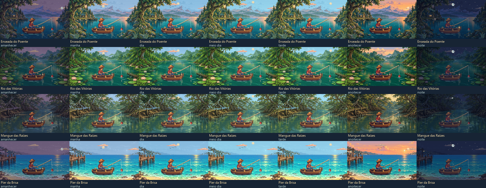

# Expansão: oito águas

Implementação preparada em `codex/expansao-mapas-periodos`, partindo da main
`6b29b4a0da3ce403dad4ff46e7f656659d2266f1`, em worktree separado. A pasta em uso,
as branches anteriores e o save pessoal foram preservados. O pacote histórico
foi adaptado ao projeto BernardoJ/PescaIdle; não houve retorno ao SHA antigo.

## Conteúdo e viagem

| Local | Nível de barco |
|---|---:|
| Enseada do Poente | 0 |
| Rio das Vitórias | 1 |
| Mangue das Raízes | 2 |
| Píer da Brisa | 3 |
| Recife das Cores | 4 |
| Mar dos Ventos | 6 |
| Mar das Auroras | 8 |
| Fossa das Lanternas | 10 |

Desbloqueios são permanentes e a viagem é gratuita. Durante a espera, a viagem
mantém o tempo restante. Durante a fisgada, o último destino escolhido fica
pendente; o resultado termina no local de origem antes da viagem.

O catálogo efetivo contém as 49 entradas antigas e 39 novas: 68 peixes, 20
encontros especiais e 90 relações espécie-local. Lambari e Pacu têm duas
ocorrências. Pacu à noite é possível no Rio, nunca na Enseada. Lixo fica fora da
coleção. Nomes, desbloqueios e horários foram comparados diretamente ao anexo.

## Relógio e pescaria

| Período | Horário local, fim exclusivo |
|---|---|
| Amanhecer | 05–07 |
| Manhã | 07–09 |
| Dia | 09–11 |
| Meio-dia | 11–14 |
| Tarde | 14–17 |
| Anoitecer | 17–20 |
| Noite | 20–05 |

Uma regra central atende pesca, cabeçalho e iluminação. A paleta interpola
continuamente; a elegibilidade muda exatamente no limite. A fisgada de 1,5 s
congela resultado, mapa, período, instante UTC, offset e níveis de equipamento
no início. Uma fisgada iniciada às 06:59:59,5 continua usando amanhecer ao
terminar às 07:00:01. O resultado pendente e o RNG dedicado são persistidos.
Prévia, animação e partículas nunca usam a sequência aleatória da pesca.

Mamíferos, tartarugas e mantas são avistamentos junto à água, com imagens maiores,
sem serem puxados pelo anzol. Plâncton e organismos pequenos usam registro de
amostra. Cada ciclo tem um único resultado e uma única recompensa.

## Coleção e conquistas

Enciclopédia conserva ordenação alfabética/quantidade e revela valor em 1,
raridade em 5, curiosidade em 10 registros. Por padrão mostra descobertas; a
opção de pistas exibe silhuetas sem nome, raridade, valor ou nome científico.
Filtros incluem local, período e disponível agora. Global e regional são
distintos; capturas migradas não recebem localização inventada.

`rei_pesca` continua com meta fixa de 49 espécies e mantém concessões antigas.
`colecao_expansao_88` usa as 88 entradas deste pacote, mesmo se um catálogo futuro
crescer. Fashionista exige somente cosméticos vendidos, sem peças de upgrade ou
recompensas. Enciclopédia Viva exige 10 registros de cada entrada; concede uma
vez o acessório de livro luminoso, grátis, sem equipar automaticamente.

IDs de itens e conquistas antigas foram mantidos ao renomear Dragão Digital,
Gorro de Rato Elétrico, Eu escolho você! e Mostre-me seu Coração Valente.

## Arte e cosméticos

Os sete fundos inéditos foram gerados com imagegen, com prompts e masters
preservados em `assets/source/mapas`. Não utilizam sprites de jogos terceiros.
Produção em 256×144, paleta limitada e máscaras próprias de água, céu, material e
margem. As configurações vazias de margem são explícitas para os mares abertos.
As luzes da cabana e os adereços da Enseada não são aplicados a outros mapas.
Aurora é noturna; a superfície da Fossa acompanha o relógio local.

O renderer compartilha cosméticos em LRU de 192 imagens, sprites de espécies
em cache finito e até dois conjuntos pesados de mapa/iluminação. As 88 entradas
têm identidade gráfica baseada em família, proporção, paleta e detalhes. Ícones,
silhuetas e apresentações reutilizam esses sprites originais feitos em Qt.

Capuz de raposa e elmo de samurai agora deixam a face dentro da abertura, atrás
da borda superior. Martelo tem cabo menor, segue a mão e preserva raios. Cajado
apresenta episódios de 4–7 s de nuvens/chuva em momentos variados, sem RNG de
pesca. Teias têm três conjuntos; broche lunar emite prata; orbe mostra esfera
laranja com estrela e dragão verde voando. Sabre, constelação e chamas receberam
luz, asas receberam cores vivas. O livro recompensa tem páginas e partículas.

Pesquisa e limites científicos: [fontes](FONTES_ESPECIES.md). Persistência e
offline: [migração](MIGRACAO_SAVE.md). Métricas: [balanceamento](BALANCEAMENTO_EXPANSAO.md).
